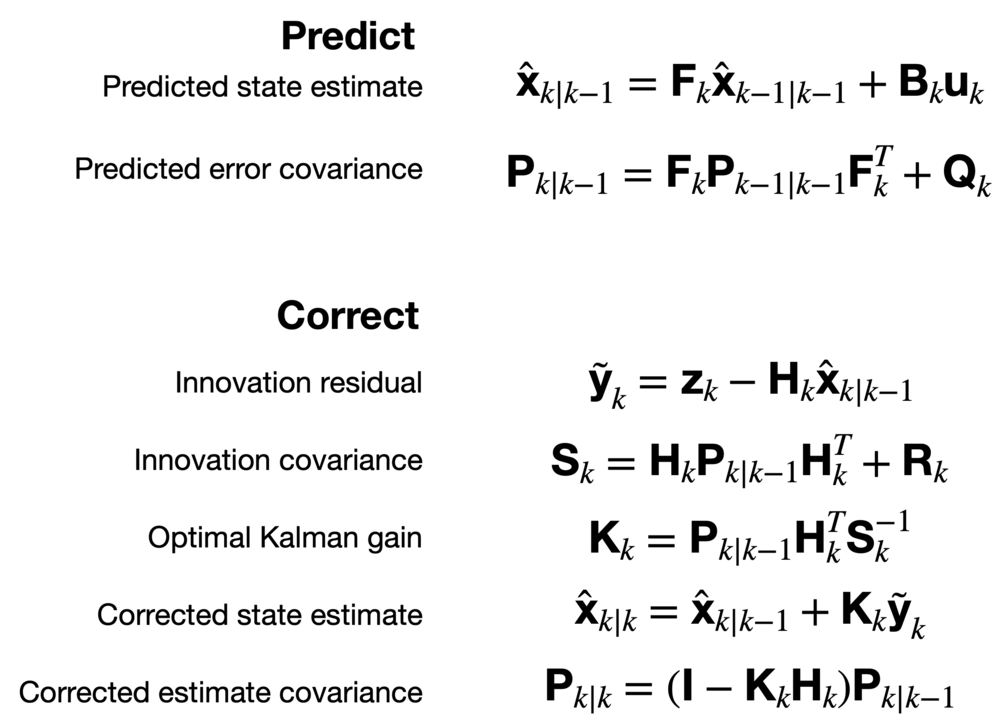

Predicted state estimate should be:
$\hat x_{k|k-1} = f(x_{k-1|k-1}, u_k)$

When predicting error covariance $F_k$ should be evaluated at $k-1$ ie:
$F_k = \frac{\delta f}{\delta x} \big |_{k} $

$
x = 
\left[ \begin{array}{lcl}
  x \\
  y \\
  \theta \\
  \phi
\end{array} \right] 
$

$
\dot f(x, u) = 
\left[ \begin{array}{lcl}
  cos(\theta)au_1 \\
  sin(\theta)bu_2 \\
  \frac{1}{L}tan(bu_2)au_1 \\
  bu_2
\end{array} \right] 
$

$
f(x,u) = x_{k-1} + 
\left[ \begin{array}{lcl}
  cos(\theta)au_1 \\
  sin(\theta)bu_2 \\
  \frac{1}{L}tan(bu_2)au_1 \\
  \frac{bu_2}{\Delta t}
\end{array} \right] \Delta t
$

$
\frac{\delta f}{\delta x} = 
\left[ \begin{array}{lcl}
  1 & 0 & 0 & 0 \\
  0 & 1 & 0 & 0 \\
  0 & 0 & 1 & 0 \\
  0 & 0 & 0 & 1
\end{array} \right] 
+
\left[ \begin{array}{lcl}
  0 & 0 & -sin(\theta)au_1 & 0 \\
  0 & 0 & cos(\theta)bu_2 & 0\\
  0 & 0 & 0 & 0 \\
  0 & 0 & 0 & 0
\end{array} \right] \Delta t
$

